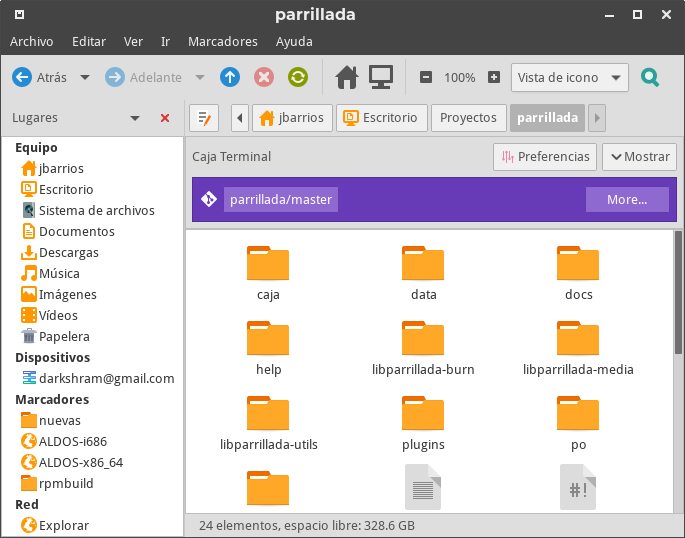
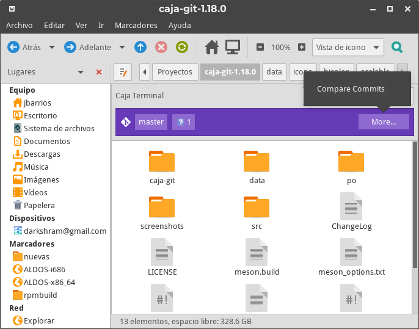

# caja-git

Caja extension to add important information about the current git directory.
This porject is based on nautilus-git by Bilal Elmoussaoui.

## Screenshots

 <div align="center"></div>

 <div align="center"></div>


## Requirements:

### Runing dependecies

- `python2`
- `git`
- `caja-python` or `python2-caja`


### Building dependencies

- `meson`
- `ninja`
- `intltool`
- `gtk+-3.0`
- `gobject-introspection`:
  - Debian/Ubuntu : `libgirepository1.0-dev`
  - Fedora : `gobject-introspection-devel`
  - Archlinux :  `gobject-introspection`

### Manual installation

1- Install requirements

2- Clone the repository

```bash
git clone https://github.com/darkshram/caja-git
```

3- Build it!

```bash
cd caja-git
mkdir build
cd build
meson .. --prefix /usr -Dfile_manager=caja
sudo ninja install
```


4- Restart Caja

```bash
caja -q
```

## How to uninstall

1- Download the uninstallation file

```bash
cd /tmp && wget -O uninstall.sh https://raw.githubusercontent.com/darkshram/caja-git/master/uninstall.sh
```

2- Make the file executable

```bash
chmod +x ./uninstall.sh
```

3- Run it!

```bash
sudo ./uninstall.sh /usr
```

PS : Replace `/usr` with whatever installation prefix you have chosen before.

## Credits

The `caja-git-symbolic` icon was designed by gitg design team.
